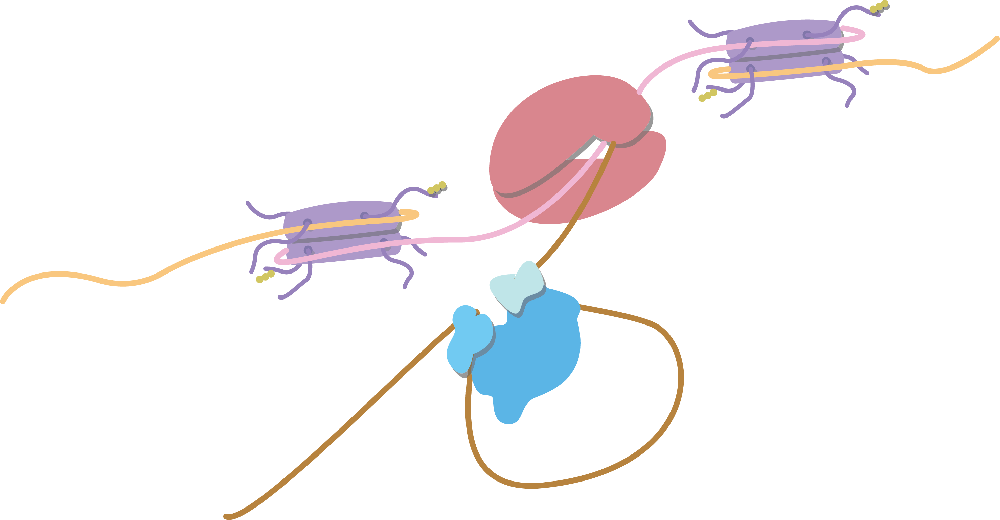

## Intron Biology 

Introns are non-coding sequences within genes that are transcribed into RNA but are spliced out before translation into protein. Despite introns being ubiquitous features of eukaryotic genomes, their function and persistence in genomes remain elusive. My research aims to unravel the role of introns in chromatin structure and explore how their architecture and sequences influence transcriptional regulation.
